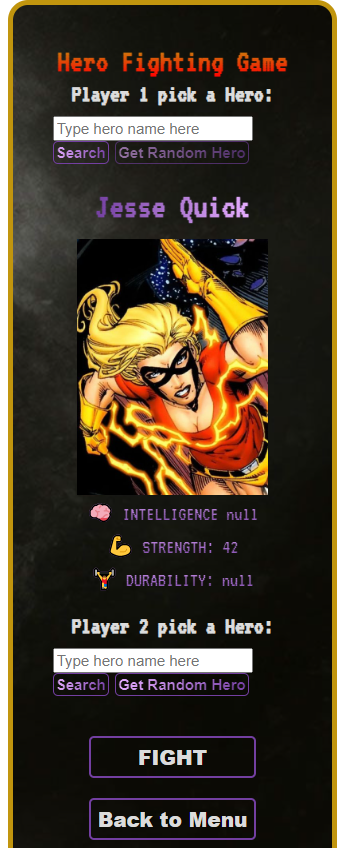

# Hero Fight Game
A Hero Combat Game combining previous apps: Super Hero App and Fighting Game. Developed using vanilla JS.

## Table of contents
* [Technologies](#technologies)
* [Functionalities](#functionalities)
* [Screens](#screens)
* [Live](#live-star2)

## Technologies
Project was created with:
* HTML5
* CSS3
* JavaScript

## Functionalities
In project You are able to:
* pick a Hero- You can search for hero by typing name like "batman" or "spider-man" or You can generate a random Hero,
* see Your stats: intelligence for heal, strenght for firepower and durability for health points value,
* fight between two players using Q for attack and A for heal as player 1 and P for attack and L for heal as player 2 (**only on desktop version!**),
* see Your remaining health points,
* reset the fight,
* simulate the fight.

## Screens  

### previous version: 
 

## Live :star2:
https://zasada94.github.io/herofightgame/
